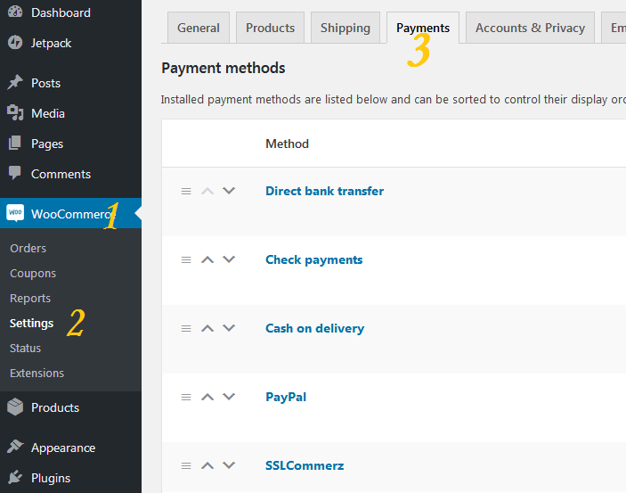

# SSLCommerz for WooCommerce

> WooCommerce plugin for SSLCommerz payment gateway with IPN Support.

## Getting Started

### Prerequisites

1. Wordpress 5.1.*
2. WooCommerce 3.6.*
3. cURL php extension.

### Installation

1. Download zip file or Clone the repository.
2. Unzip if downloaded zip file.
3. Move the whole directory to ```/wp-content/plugins/```
4. Activate the plugin through the 'Plugins' menu in admin panel.

**[NOTE]** This plugin will automatically set the IPN url, there is no need to set IPN in merchant panel when using this.

### Configuration

1. Open Admin Panel.
2. Navigate to ```Woocommerce > Settings > Payments``` tab.



3. Click on SSLCommerz to edit the settings. If you do not see SSLCommerz in the list at the top of the screen make sure you have activated the plugin in the WordPress Plugin Manager.
4. Enable the Payment Method, give a proper title and description to show on the checkout page,  fill up stroe id and store passowrd fields carefully, select success and fail/cancel page.
5. Setup is complete. Check if everything is working properly.


## FAQ

### What is WooCommerce?
> WooCommerce is an open-source e-commerce plugin for WordPress. 

### What is SSLCommerz?
> SSLCOMMERZ is the first payment gateway in Bangladesh opening doors for merchants to receive payments on the internet via their online stores.
### What is a Payment Gateway?
> Payment Gateway is a service that allows merchant to accept secure credit card transactions online. It essentially connects a merchant website to a transaction processor like bank to take payment from a customer for an order.


## Contributors
> Prabal Mallick
