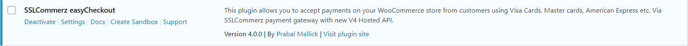
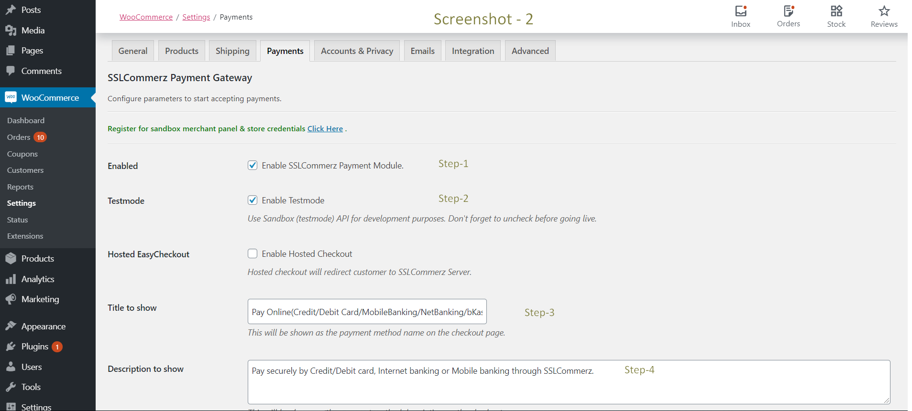
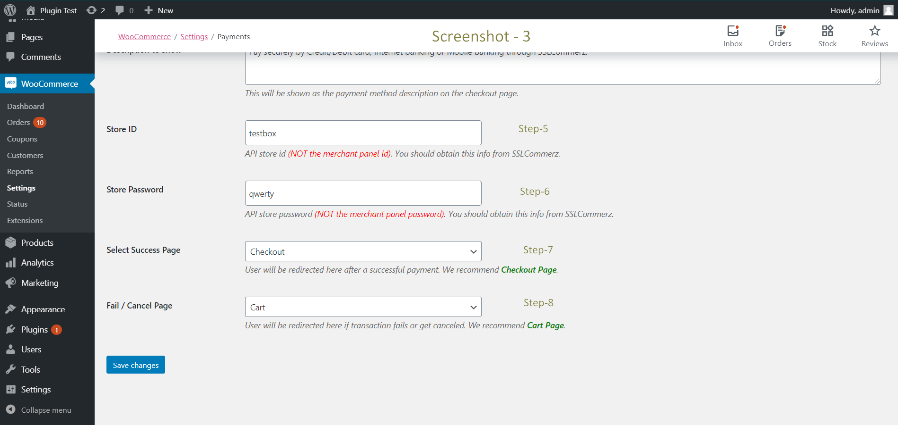

# SSLCommerz Payment Gateway

> SSLCOMMERZ is the first payment gateway in Bangladesh opening doors for merchants to receive payments on the internet via their online stores. Their customers will be able to buy products online using their credit cards as well as bank accounts. If you are a merchant, you have come to the right place! WooCommerce plugin for SSLCommerz payment gateway with Dynamic IPN Support.

## Getting Started

### Also available at [Wordpress Plugin Store](https://wordpress.org/plugins/wc-sslcommerz-easycheckout/ "SSLCommerz Payment Gateway")

### Prerequisites

1. Wordpress 5.1 or later
2. WooCommerce 3.6 or later
3. cURL php extension enabled.
4. [Sandbox Credentials](https://developer.sslcommerz.com/registration/ "SSLCommerz Sandbox Registration") or [Live Credentials](https://signup.sslcommerz.com/register/ "Merchant Registration")

### Support
> If you face any technical issue and need support, please communicate **via email** at **integration@sslcommerz.com**.

### Installation

1. Download zip file or Clone the repository.
2. Go to `Plugins > Add New`.
3. Click on `Upload Plugin` button.
4. Go to `Choose File` and upload the Zip file of plugin.
5. Active the plugin.


> This plugin will automatically set the IPN url, there is no need to set IPN in merchant panel when using this.

### Configuration

1. Open Admin Panel.



2. Navigate to ```Woocommerce > Settings > Payments``` tab.




3. Click on SSLCommerz to edit the settings. If you do not see SSLCommerz in the list at the top of the screen make sure you have activated the plugin in the WordPress Plugin Manager.
4. Enable the Payment Method, give a proper title and description to show on the checkout page,  fill up stroe id and store passowrd fields carefully, select success and fail/cancel page.
5. You can enable or disable Hosted/Popup mode from `Hosted EasyCheckout` 
6. Setup is complete. Check if everything is working properly.


## FAQ

### I am getting error which says my store is de-active.
> check Testmode, Store ID and Store Password in the settings. If issue still persists, communicate with merchnat's Key Account Manager (**KAM**).
 
### How can I enable IPN?
> This plugin handled IPN with ZERO configuration. No action needed from your end. 

### I want to create order in woocommerce only if transaction is successful. Otherwise order will not be placed.
> This is NOT possible. Order gets created before going to payment page with "Pending" status. After transaction order status will be updated within a short time. 

### I want to enable EMI option, how it works?
> To enable EMI option first you have to make an agreement with us. To do that please communicate with the Business person, you have communicate at the time of Store registration. Besides this in live, you will have EMI configuration option after login to your Merchant report panel go to `My Stores>EMI Settings`.

### I want my customer will bear the gateway charges. How can I do that?
> Yes, We have solution for this, you can configure this from your merchant panel or mail to `operation@sslcommerz.com` .

## Contributors
> Prabal Mallick, Md. Rakibul Islam
> 
> Email: integration@sslcommerz.com
